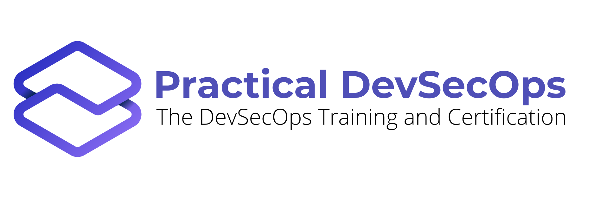

Welcome to Awesome-security-compliance 
===================

A curated list of compliance resources ( Books, courses - free and paid, videos, tools, tutorials and workshop to practice on ) for learning Security Compliance 

### Contents
- [Books](#books)
- [Courses](#courses)
   + [Free](#free)
   + [Paid](#paid)
- [Videos](#videos)
- [Tutorials and Blogs](#tutorials-and-blogs)
- [Tools](#tools)
  + [cloud tools](#cloud-tools)
- [Contributing](#contributing)

# Awesome-security-compliance  Resources

## Books

*Books on security compliance*

- [The Practical Guide to HIPAA Privacy and Security Compliance ](https://www.amazon.com/Practical-Guide-Privacy-Security-Compliance/dp/1439855587) by Rebecca Herold  (Author), Kevin Beaver  (Author)

- [Building a HIPAA-Compliant Cybersecurity Program: Using NIST 800-30 and CSF to Secure Protected Health Information](https://www.amazon.com/Building-HIPAA-Compliant-Cybersecurity-Program-Information/dp/1484230590) by Eric C. C. Thompson (Author)

- [PCI Compliance: Understand and Implement Effective PCI Data Security Standard Compliance](https://www.amazon.com/PCI-Compliance-Understand-Implement-Effective/dp/0128015799 ) by Branden R. Williams  (Author), Anton Chuvakin Ph.D. Stony Brook University Stony Brook NY. (Author)

- [IBM i Security Administration and Compliance](https://www.amazon.com/IBM-i-Security-Administration-Compliance/dp/1583474293 ) by Carol Woodbury (Author)

- [HIPAA Privacy and Security Compliance - Simplified: Practical Guide for Healthcare Providers and Managers 2016 Edition](https://www.amazon.com/HIPAA-Privacy-Security-Compliance-Simplified/dp/1537494279) by Robert K Brzezinski  (Author)

- [System Administration Ethics: Ten Commandments for Security and Compliance in a Modern Cyber World](https://www.oreilly.com/library/view/system-administration-ethics/9781484249888/) by Tom Litterer, Igor Ljubuncic

- [Simplify Management of IT Security and Compliance with IBM PowerSC in Cloud and Virtualized Environments](https://www.oreilly.com/library/view/simplify-management-of/9780738457970/) by Cesar Rodriguez, David Pontes, Stephen Dominguez, Faraz Ahmad, Dino Quintero

- [Cloud Security & Compliance For Dummies®, Palo Alto Networks® Special Edition](https://www.content.shi.com/SHIcom/ContentAttachmentImages/SharedResources/FBLP/PaloAlto/PAN-021319-cloud-security-compliance-for-dummies-ebook.pdf) by Palo Alto

- [PCI Compliance for Dummies](https://www.qualys.com/forms/ebook/pci-compliance-for-dummies/) by Qualys

## Courses

*Courses/Training videos on security compliance*

### Free  

[System Security Plan (SSP) for NIST 800-171 Compliance](https://www.udemy.com/course/system-security-plan-ssp-for-nist-800-171-compliance/) by Mark Russo

### Paid

[DevSecOps Professional Course](https://www.practical-devsecops.com/certified-devsecops-professional/) by Practical DevSecOps 

[Compliance Training](https://www.lynda.com/IT-Infrastructure-tutorials/Compliance-training/651205/747691-4.html) by Mike Chapple

[Practical SQL Server Security, Compliance, and Auditing](https://www.pluralsight.com/courses/sql-server-compliance-and-auditing) by Russ Thomas

[Security Compliance: The Big Picture](https://www.pluralsight.com/courses/security-compliance-big-picture) By Richard Harpur

[AZ-900 Azure Exam Prep: Security Privacy Compliance & Trust](https://www.udemy.com/course/az-900-azure-exam-prep-security-privacy-compliance-trust/) by Thomas Mitchell

[GDPR Office 365 Readiness Course: Compliance & Data Security](https://www.udemy.com/course/gdpr-compliance-data-security/) by Syed Raza, ClayDesk E-learning, Qasim Shah, Syed Ali

[Compliance Training and Securing the Human](https://www.sans.org/course/compliance-training-securing-the-human) by SANS

## Videos

*Videos talking about security compliance techniques, tools and best practices*

[Security and Compliance Considerations - Step 5 of Desktop Deployment](https://www.youtube.com/watch?v=8CBfhBCtGGw) by Jeremy Chapman

[Security & Compliance: First Steps to Best Practices (Level 100)](https://www.youtube.com/watch?v=ogwb6o_3kdc) by Jonathan Rault

[AWS Security & Compliance for Enterprises](https://www.youtube.com/watch?v=-tv1oLeZ1Gk) by Kevin Dobbins

[DevSecOps: Balance Speed & Agility With Security & Compliance](https://www.youtube.com/watch?v=t128TwkiL8A) by Barak Feldman

[Security and Compliance Monitoring with Forseti ](https://www.youtube.com/watch?v=4TrlgbV_VlQ) by Chris Law

[Security and compliance for Microsoft Teams](https://www.youtube.com/watch?v=jGYRI3l69-U) by Thomas Bender

[Office 365 Security and Compliance Overview](https://www.youtube.com/watch?v=04GY2fqt3TE) by Robert Crane

[Cloud Security and Compliance](https://www.youtube.com/watch?v=TXkpiB8CcJk) by Manipal ProLearn

[Security Auditing and Compliance](https://www.youtube.com/watch?v=O_noXhQ16Yk) by David Zendzian, Steve White

[Automating security compliance for physical, virtual, cloud, and container environments](https://www.youtube.com/watch?v=TKQ8l1yl3X4) by Lucy Huh Kerner

[ vSphere Security Compliance in a DevOps World](https://www.youtube.com/watch?v=3uc58GQjKxQ) by Kyle Ruddy

[Risk, Audit, and Compliance for Hackers & Defenders ](https://www.youtube.com/watch?v=RZ2oLp1VTrg) by John Nye 

[Unify Security, Compliance, and Finance Teams with Governance at Scale](https://www.youtube.com/watch?v=s1Yuj7k2DM8) by  Brian Price

[Compliance != Security (Except When It Might Be)](https://www.youtube.com/watch?v=MBf9Hi5yXgI) by Rob Clark

[Advanced Security Compliance and Risk Management with Xacta 360](https://www.youtube.com/watch?v=RIPcJ54PtV8) by Rick Tracy ,Steve Horvath

## Tutorials and Blogs

*Tutorials and blogs which explain security compliance*

[Automating cloud compliance](https://www.csoonline.com/article/3215093/automating-cloud-compliance.html) by George Grachis

[Security and Compliance: Why DevSecOps matters](https://www.devsecopsdays.com/articles/security-and-compliance-why-devsecops-matters)  by Swapnil Deshmukh

[A Beginner’s Guide to PCI Compliance](https://www.tripwire.com/state-of-security/regulatory-compliance/beginners-guide-pci-compliance/) by Megan Freshley

[Beginner’s Guide to Data Security and Information Security Compliance & Audits](https://genbin.genesys.com/old/resources/inin/beginners-guide-to-information-security.pdf) by Flavio Villanustre , Belinda Hickling

[Understanding Security and Compliance](https://www.cybrary.it/0p3n/understanding-security-compliance/) by Cybary

[A Step-by-Step Guide to Data Security Compliance by Industry](https://resources.infosecinstitute.com/step-step-guide-data-security-compliance-industry/#gref) by Infosec Institute

[Security vs Compliance: Are You Secure & Compliant? Learn the Differences](https://phoenixnap.com/blog/security-vs-compliance) by Bojana Dobran

[Compliance vs. Security – Are You Secure AND Compliant, or Just Compliant?](https://www.pivotpointsecurity.com/blog/compliance-vs-security/) by Pivotpoint Security

[What is Compliance Operations in a DevSecOps world?](https://www.devsecops.org/blog/2015/9/21/what-is-compliance-operations-in-a-devsecops-world) by  Michelle Nikulshin

[Security Compliance](https://www.akamai.com/us/en/resources/security-compliance.jsp) by Akamai

[Data Security: The Foundation for Compliance and Reduction of Compliance Spend - White Paper](https://safenet.gemalto.com/resources/data-protection/data-security-compliance-white-paper/) by Safenet

# Tools 

*Tools which helps in Security compliance*

[Chef InSpec](https://www.inspec.io/) - Turn your compliance, security, and other policy requirements into automated tests.

[Compliance Masonry](https://github.com/opencontrol/compliance-masonry) - Compliance Masonry is a command-line interface (CLI) that allows users to construct certification documentation using the OpenControl Schema.

[Microsoft Security Compliance Toolkit 1.0](https://docs.microsoft.com/en-us/windows/security/threat-protection/security-compliance-toolkit-10) - This set of tools allows enterprise security administrators to download, analyze, test, edit and store Microsoft-recommended security configuration baselines for Windows and other Microsoft products, while comparing them against other security configurations.  

[Lynis](https://cisofy.com/lynis/) - Lynis is a battle-tested security tool for systems running Linux, macOS, or Unix-based operating system. It performs an extensive health scan of your systems to support system hardening and compliance testing

[HubbleStack](https://github.com/hubblestack) - Open-source security compliance monitoring. Free and open source software made possible by Adobe.

### Cloud tools

[Cloud Custodian](https://github.com/cloud-custodian/cloud-custodian) - Rules engine for cloud security, cost optimization, and governance, DSL in yaml for policies to query, filter, and take actions on resources

[terraform-compliance](https://github.com/eerkunt/terraform-compliance) - A lightweight, security focused, BDD test framework against terraform

[CloudFormation Security Check](https://cloudsploit.com/cloudformation) - AWS CloudFormation enables automated, versioned, repeatable infrastructure described as code. That code can now be checked for potential security risks before it is deployed.

[CloudCheckr](https://cloudcheckr.com/security-and-compliance/) - CloudCheckr monitors and maintains control of your cloud’s security and compliance posture with proactive monitoring, alerts, and reports, providing confidence that your cloud is stable, secure, and compliant.

[CloudGuard Dome9](https://www.checkpoint.com/products/cloud-security-orchestration/) - CloudGuard Dome9 is a comprehensive software platform for public cloud security and compliance orchestration 

[CScanner: A Cloud Security Scanner](https://github.com/cscannerio/opensource) - This utility is intended to check your cloud configuration for compliance with your companies rules in an automated fashion, not unlike AWS Config.

[Pacbot](https://github.com/tmobile/pacbot) - Policy as Code Bot (PacBot) is a platform for continuous compliance monitoring, compliance reporting and security automation for the cloud.

[Armor](https://www.armor.com/compliance/) - Armor is a cloud security company that takes  the complexity out of protecting your data, whether it resides in a private, public, or hybrid cloud—or in an on-premise  IT environmen

[Antiope](https://github.com/turnerlabs/antiope/) Antiope (PRONO An-Tie-Oh-Pee) is intended to be an open sourced framework for managing resources across hundreds of AWS Accounts

## Contributing

[Please refer the guidelines at contributing.md for details](Contributing.md).

## Sponsored by

